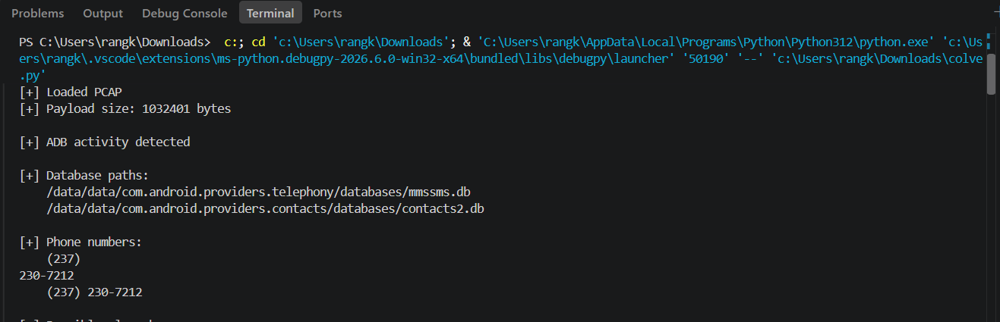
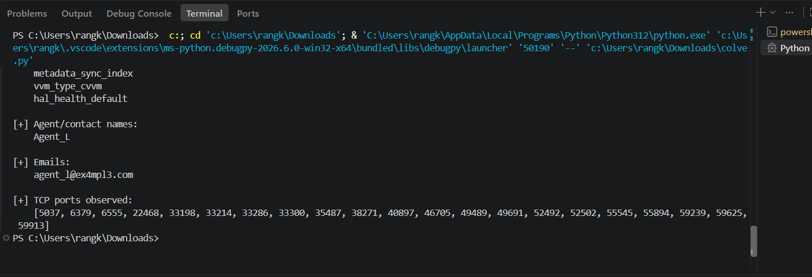
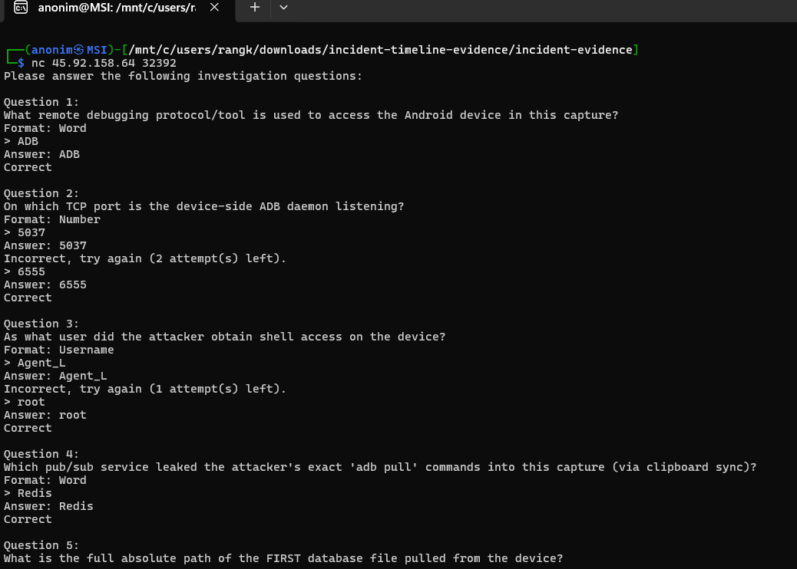
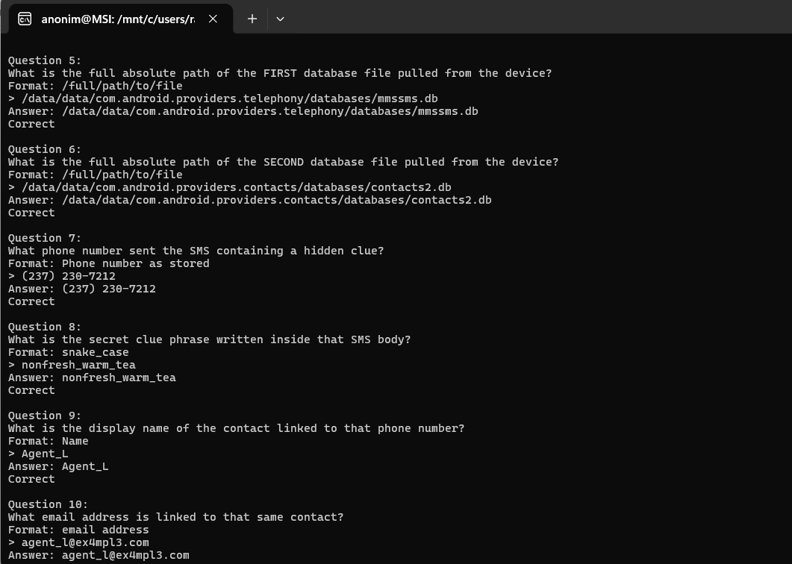

Challenge ini ngasih file **`challenge.pcap`** yang berisi capture aktivitas jaringan dari sebuah perangkat Android. Analisis dilakukan dengan ngecek komunikasi yang terekam di PCAP dan mencari jejak aktivitas attacker.

Dari traffic tersebut ditemukan kalau attacker mengakses perangkat menggunakan **ADB (Android Debug Bridge)** yang berjalan pada **TCP port 6555**, kemudian mendapatkan shell sebagai **root**. Selain itu, service **Redis** ternyata membocorkan command `adb pull` melalui clipboard sync.

Dari command tersebut kelihatan attacker mengambil dua database Android:

* `/data/data/com.android.providers.telephony/databases/mmssms.db`
* `/data/data/com.android.providers.contacts/databases/contacts2.db`

Database `mmssms.db` kemudian dianalisis untuk mencari SMS yang mencurigakan. Ditemukan SMS dari nomor **`(237) 230-7212`** dengan hidden clue:

`nonfresh_warm_tea`

Nomor tersebut kemudian dicocokkan dengan database `contacts2.db`. Hasilnya nomor itu terhubung dengan kontak **`Agent_L`** dan email:

`agent_l@ex4mpl3.com`

Jadi alur challenge-nya simpel: **PCAP → identifikasi ADB → temukan `adb pull` → recover database SMS & kontak → korelasikan nomor → dapat clue dan identitas kontak.**

## berikut proses rekon

ini yang ditemukan dari colve.py saya:

## Evidence

Berikut tinggal submit hasil yg dianalisis `challenge.pcap`:

